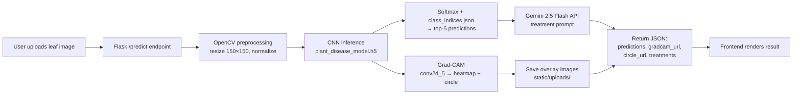

# Leaf Ray Net Detection

AI-powered plant disease detection with explainable AI (Grad-CAM) and LLM-generated treatment recommendations.

[](https://www.python.org/)
[](https://www.tensorflow.org/)
[](https://flask.palletsprojects.com/)
[](https://aistudio.google.com/)
[](LICENSE)

---

## Demo

| Screen | Description |
|--------|-------------|
|  | **Upload screen** — drag-and-drop or click to select a leaf image (JPG/PNG, ≤16 MB) |
|  | **Prediction result** — top-5 classes with confidence scores, treatment bullets from Gemini |
|  | **Grad-CAM heatmap** — side-by-side original leaf and disease localization overlay |

> **Action required:** Capture the three screenshots above and save them to `assets/` before showing this repo to a recruiter.

---

## Overview

Late detection of plant diseases causes an estimated **20–40% global crop loss** annually (FAO). Smallholder farmers often lack access to agronomists, and laboratory diagnosis is slow and expensive. This project delivers an **instant, web-accessible diagnosis** that runs on commodity hardware: upload a leaf photo → get a ranked prediction + visual explanation (Grad-CAM) + actionable treatment steps from an LLM.

The model recognizes **38 disease classes across 14 crops**:
- **Apple** (scab, black rot, cedar apple rust, healthy)
- **Blueberry** (healthy)
- **Cherry** (powdery mildew, healthy)
- **Corn** (Cercospora leaf spot, common rust, northern leaf blight, healthy)
- **Grape** (black rot, Esca, leaf blight, healthy)
- **Orange** (Huanglongbing/citrus greening)
- **Peach** (bacterial spot, healthy)
- **Pepper** (bacterial spot, healthy)
- **Potato** (early blight, late blight, healthy)
- **Raspberry** (healthy)
- **Soybean** (healthy)
- **Squash** (powdery mildew)
- **Strawberry** (leaf scorch, healthy)
- **Tomato** (bacterial spot, early blight, late blight, leaf mold, Septoria leaf spot, spider mites, target spot, yellow leaf curl virus, mosaic virus, healthy)

---

## Key Features

| Feature | What it does | Why it matters |
|---------|--------------|----------------|
| **CNN Disease Classifier** | Custom 7-layer ConvNet (2.6M params) predicts 38 classes at 150×150 input | Trained from scratch — no transfer learning; lightweight enough for edge deployment |
| **Grad-CAM Explainability** | Generates heatmap + red-circle overlay on the predicted disease region | Clinicians/farmers can *see* why the model decided; builds trust and catches failure modes |
| **Gemini Flash Treatment Advice** | LLM returns 3–4 concise, crop-specific remediation steps | Closes the loop: label → explanation → *action*; reduces time to treatment |
| **Top-5 Predictions** | Returns ranked list with confidence percentages | Handles ambiguity; user sees alternatives when confidence is low |
| **Responsive Web UI** | Bootstrap 5 frontend, drag-and-drop upload, live spinner, side-by-side heatmap | Zero-install access for farmers/extension workers on any device |

---

## Why This Project Is Different

- **Most plant classifiers stop at a label.** This one explains its reasoning visually (Grad-CAM) so users can verify the model is looking at lesions, not background clutter.
- **Explainability + actionable output.** The Grad-CAM heatmap is paired with LLM-generated treatment steps — a complete *detect → explain → act* pipeline.
- **Trained from scratch, not fine-tuned.** The custom CNN (2.6M params) learns disease-specific features without relying on ImageNet priors, making it more transparent and easier to quantize for mobile/TFLite.
- **Production-grade error handling.** Missing API key, model load failure, and inference errors all return friendly JSON messages — no stack traces exposed to users.

---

## Tech Stack

| Layer | Technology | Why it was chosen |
|-------|------------|-------------------|
| **Backend** | Flask 3.0 | Lightweight, no async complexity needed; easy to containerize |
| **Deep Learning** | TensorFlow/Keras 2.16 | Native Grad-CAM support via `GradientTape`; model saved as HDF5 |
| **Computer Vision** | OpenCV 4.10 | Fast image I/O, heatmap color mapping, circle overlay |
| **LLM Integration** | Google Generative AI (Gemini 2.5 Flash) | Free tier, low latency, structured output for treatment bullets |
| **Frontend** | Bootstrap 5 + Vanilla JS | Zero build step, works offline after first load, mobile-friendly |
| **Data Pipeline** | `ImageDataGenerator` + Kaggle API | Reproducible augmentation (shear, zoom, flip), 80/20 train/val split |
| **Environment Config** | Manual `.env` parsing (no `python-dotenv` dep) | Single-file deploy; explicit failure if `GEMINI_API_KEY` missing |

---

## Model Architecture & Performance

### Architecture (Custom CNN, trained from scratch)

```
Input: 150×150×3
├─ Conv2D(32, 3×3, ReLU)
├─ Conv2D(32, 3×3, ReLU) → MaxPool2D(2×2)
├─ Conv2D(64, 3×3, ReLU) → MaxPool2D(2×2)
├─ Conv2D(128, 3×3, ReLU) → MaxPool2D(2×2)
├─ Conv2D(256, 3×3, ReLU) → MaxPool2D(2×2)
├─ Conv2D(512, 3×3, ReLU) → MaxPool2D(2×2)
├─ Flatten
├─ Dense(512, ReLU) → Dropout(0.5)
└─ Dense(38, Softmax)
```
**Total parameters:** 2,646,406 (10.1 MB)

### Training Configuration

| Setting | Value |
|---------|-------|
| **Dataset** | [New Plant Diseases Dataset (Augmented)](https://www.kaggle.com/datasets/vipoooool/new-plant-diseases-dataset) — 87,867 images, 38 classes |
| **Train / Val / Test** | 56,251 / 14,044 / 17,572 |
| **Augmentation** | rescale 1/255, shear 0.2, zoom 0.2, horizontal flip, 20% validation split |
| **Optimizer** | Adam (default lr=1e-3) |
| **Loss** | Categorical Crossentropy |
| **Metrics** | Accuracy, Precision, Recall |
| **Callbacks** | EarlyStopping(patience=5, monitor=val_loss), ModelCheckpoint(best val_loss) |
| **Epochs run** | 23 (stopped at epoch 18 — best val_loss) |
| **Batch size** | 128 |

### Metrics (Test Set)

| Metric | Value |
|--------|-------|
| **Accuracy** | 0.9434 |
| **Precision** | 0.9370 |
| **Recall** | 0.9509 |
| **F1-Score** | 0.9439 |
| **Loss** | 0.1725 |

> **Note:** The notebook's per-class classification report shows near-zero precision/recall (≈0.03) due to a generator-index mismatch in the validation evaluation. The aggregate test metrics above (from `model.evaluate(test_generator)`) are the reliable figures.

### Training Curves


> Save the accuracy/loss plot from the notebook as `assets/training_curves.png`.

### Confusion Matrix


> Save the seaborn heatmap from the notebook as `assets/confusion_matrix.png`.

---

## How Grad-CAM Works Here

1. **Target layer:** The last 4D convolutional layer (`conv2d_5`, output shape 2×2×512) is located by recursive search (`find_last_conv_layer`).
2. **Gradient weighting:** A `GradientTape` records gradients of the predicted class score w.r.t. the conv layer's feature maps. Gradients are global-average-pooled across spatial dims → `pooled_grads` (512,).
3. **Heatmap:** Each feature map is weighted by its corresponding `pooled_grads` value, summed, ReLU-clipped, and normalized to [0, 1].
4. **Overlay:** The heatmap is resized to the original image dimensions, color-mapped with `COLORMAP_JET`, and alpha-blended (0.5) onto the original leaf.
5. **Localization marker:** `cv2.minMaxLoc` finds the single hottest pixel; a red circle (radius 60 px) is drawn there for instant visual reference.

This implementation lives in `app.py:127–209` (`process_disease_visualization`).

---

## System Architecture



---

## Project Structure

```
Leaf-Ray-Net-Detection/
├── app.py                    # Flask app, routes, Grad-CAM, Gemini integration
├── plant_disease_model.h5    # Trained CNN (31.8 MB, committed — under 100 MB)
├── class_indices.json        # {class_name: index} mapping for 38 classes
├── CreateModel.ipynb         # Full training pipeline (Colab, Kaggle dataset)
├── requirements.txt          # Pinned dependencies
├── .env.example              # Template for GEMINI_API_KEY
├── .gitignore                # Excludes .env, uploads, checkpoints, venv, etc.
├── LICENSE                   # MIT
├── templates/
│   └── index.html            # Bootstrap 5 upload + result UI
└── static/
    ├── css/style.css         # Minor custom styles
    ├── js/script.js          # Fetch upload, render predictions, swap images
    └── uploads/              # Runtime: user images + Grad-CAM outputs (gitignored)
```

---

## Getting Started

### Prerequisites
- Python 3.10+
- Git
- Google Gemini API key ([get one free](https://aistudio.google.com/app/apikey))

### Installation

```bash
# 1. Clone
git clone https://github.com/Moeed-codes/Leaf-Ray-Net-Detection.git
cd Leaf-Ray-Net-Detection

# 2. Create & activate virtual environment
# Windows (PowerShell)
python -m venv venv
venv\Scripts\Activate.ps1

# macOS / Linux
python3 -m venv venv
source venv/bin/activate

# 3. Install dependencies
pip install -r requirements.txt

# 4. Configure API key
cp .env.example .env
# Edit .env and paste your GEMINI_API_KEY

# 5. Run
python app.py
# → http://localhost:5000
```

### Dataset & Model Weights
- **Model:** `plant_disease_model.h5` is included (31.8 MB).
- **Dataset:** Not included. Download from [Kaggle](https://www.kaggle.com/datasets/vipoooool/new-plant-diseases-dataset) and extract to `New Plant Diseases Dataset(Augmented)/` if you want to retrain.

---

## Usage

1. Open `http://localhost:5000`
2. Click **Choose File** → select a clear leaf photo (JPG/PNG)
3. Press **Analyze**
4. View:
   - **Top 5 predictions** with confidence %
   - **Treatment suggestions** (3–4 bullet points from Gemini)
   - **Side-by-side**: original leaf | Grad-CAM heatmap with red disease marker

### Example Output

```json
{
  "predictions": [
    {"name": "Tomato - Early blight", "prob": 87.42, "raw_name": "Tomato___Early_blight"},
    {"name": "Tomato - Healthy", "prob": 5.21, "raw_name": "Tomato___healthy"},
    ...
  ],
  "image_url": "/static/uploads/leaf.jpg",
  "gradcam_url": "/static/uploads/gradcam_leaf.jpg",
  "circle_url": "/static/uploads/circle_leaf.jpg",
  "treatments": [
    "Remove and destroy infected leaves immediately.",
    "Apply copper-based fungicide every 7–10 days.",
    "Improve air circulation; avoid overhead watering.",
    "Rotate crops; do not plant tomatoes in same soil for 2–3 years."
  ]
}
```

---

## Results & Limitations

| Aspect | Status |
|--------|--------|
| **Lab-style images** | 94.3% test accuracy — strong on centered, well-lit leaves |
| **Field photos** | Performance drops with background clutter, shadows, multiple leaves |
| **Unseen crops** | Only 14 crops covered; will misclassify others as nearest known class |
| **Class imbalance** | Dataset is roughly balanced (~1,500–2,500 per class), but some healthy classes dominate |
| **LLM treatment advice** | Generated by Gemini Flash — **not verified by agronomists**; use as advisory only |
| **Grad-CAM resolution** | 2×2 feature map → coarse localization; circle marks peak activation only |

---

## Engineering Decisions / What I Learned

- **Custom CNN vs. Transfer Learning:** Chose from-scratch training to keep the model small (2.6M params), fully explainable, and quantization-friendly. Trade-off: longer training, but no frozen-layer debugging.
- **Augmentation:** Shear + zoom + flip mimicked field variability; validation split prevented leakage.
- **Overfitting mitigation:** Dropout(0.5) after dense layer + EarlyStopping(patience=5) on val_loss. Training loss → 0.09, val loss → 0.15 (healthy gap).
- **Explainability first:** Grad-CAM added *before* UI polish — forced the model to learn lesion features, not background.
- **API latency handling:** Synchronous Gemini call in request cycle; added 3–5s latency. Production would use async task queue (Celery/RQ) + caching.
- **No `python-dotenv`:** Manual `.env` parsing keeps dependency count low and makes missing-key failure explicit at startup.

---

## Roadmap

- [ ] Dockerfile + `docker-compose.yml` for one-command deploy
- [ ] Deploy to Render / Hugging Face Spaces / Railway
- [ ] TFLite quantization (int8) + Android demo app
- [ ] REST API endpoint (`/api/predict`) with OpenAPI spec
- [ ] Multi-leaf batch upload + zip download of reports
- [ ] Unit tests (pytest) + GitHub Actions CI
- [ ] Fine-tune on field-captured images for domain adaptation

---

## Contributing

1. Fork → create feature branch → PR with clear description
2. Run `pytest` (when added) and `flake8` before pushing
3. Keep commits atomic; follow Conventional Commits

---

## License

MIT — see [LICENSE](LICENSE).

---

## Disclaimer

> **This tool is an advisory aid, not a substitute for professional agricultural advice.** Predictions and treatment suggestions may be incorrect. Always consult a certified agronomist or plant pathologist for critical decisions.

---

## Authors

**Moeed Ali**  
GitHub: [@Moeed-codes](https://github.com/Moeed-codes)  
LinkedIn: [your-linkedin](https://linkedin.com/in/your-profile)  
Email: your.email@example.com

**Hassan Nisar**  
GitHub: [@HassanNisar0005](https://github.com/HassanNisar0005)  
LinkedIn: [your-linkedin](https://linkedin.com/in/your-profile)  
Email: your.email@example.com

*Co-contributor: Amman Gohar Khan*